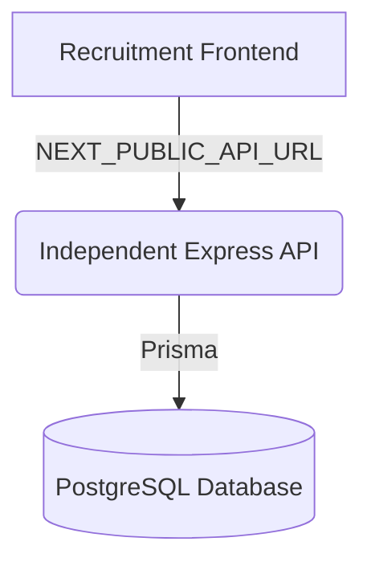

# HackClub VIT Recruitment & Interview Management Platform

Welcome to the HackClub VIT Recruitment Platform. This platform handles the entire lifecycle of student recruitment, application processing, candidate filtering, interview scheduling, panel management, and analytics.

## Architecture

This project is built using a decoupled architecture, clearly separating the frontend client from the backend API logic.



### Components

1. **Recruitment Frontend (Next.js)**
   - Located in the root directory (`app/`, `src/`).
   - Purely a frontend client communicating strictly via cross-domain credentials to the API.
   - Run with `pnpm run dev` and build with `pnpm run build`.

2. **Independent API (Express.js)**
   - Located in the `api/` directory.
   - Owns authentication, session cookies, database access (Prisma), and all core business logic.
   - Exposes REST endpoints on port 3001.

3. **Database (PostgreSQL)**
   - Powered by Prisma (schemas located in `api/prisma/schema.prisma`).

## Getting Started

### 1. Database Setup
Ensure you have PostgreSQL running. Run the following from the `api/` directory:
```bash
cd api
pnpm install
npx prisma generate
npx prisma db push
npx prisma db seed
```

### 2. Independent API
The API handles all requests and owns the `JWT_SECRET` for authentication.
```bash
cd api
pnpm run dev
# The API will be available at http://localhost:3001
```

**Environment Variables (`api/.env`):**
- `DATABASE_URL`
- `JWT_SECRET` (Must be set securely in production)
- `ALLOWED_ORIGIN` (For CORS, e.g., `http://localhost:3000`)
- `PORT` (Defaults to 3001)

### 3. Recruitment Frontend
The frontend requires only the public API URL to function.
```bash
pnpm install
pnpm run dev
# The frontend will be available at http://localhost:3000
```

**Environment Variables (`.env`):**
- `NEXT_PUBLIC_API_URL`: Should point to the running API (e.g., `http://localhost:3001`). Must be set in production.

## Authentication & Authorization

Authentication is natively handled via `httpOnly`, `secure`, and `sameSite` cookies issued by the `api/` service. 
The Next.js frontend uses NextMiddleware solely for User Experience (UX) redirection by decoding the unverified token payload, ensuring that the API remains the singular authoritative source of truth for validation.
